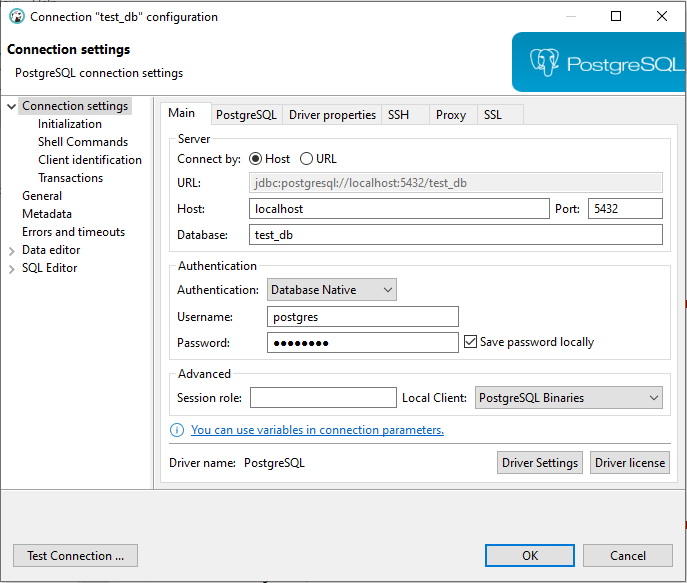

# Shortener Url API REST
**Java version 17**

---

* **Objetivo**

O Microservice consiste em encurtar uma Url desejada, ajudando de uma forma mais prática e fácil.

---

* **Preparando o ambiente**

É necessário baixar o Docker Desktop -> https://www.docker.com/products/docker-desktop/
depois vá na raiz do projeto vai ver o arquivo docker-compose.yml, usando qualquer cmd
na pasta onde se encontra o arquivo digite **docker-compose up** depois verifique se a imagem do postgreSql apareceu.

---

Também é necessário uma ferramenta de SGBD, ou qualquer outra do seu gosto, abaixo segue o link:
https://dbeaver.io/download/

Abrir o DBeaver e criar nova conexão.
Na janela que abrir, deve ser inserida as informações da conexão nos campos:

 - a) Host: localhost
 - b) Database: test_db
 - c) Port: 5432
 - d) Username: postgres
 - e) Password: postgres

Depois rodar o Script salvo na raiz do prejeto na pasta script vai está lá o shortener-script.sql



---

### Endpoints

Swagger

http://localhost:8080/swagger-ui/index.html#/

---

Postman

* **POST**<br />
Criar uma url encurtada http://localhost:8080/create-short-url <br />Exemplo payload
```
{

  "originUrl": "https://www.google.com.br/?hl=pt-BR"
  
}
```

---

* **GET**
<br />Pegar as estatísticas de acesso às URLs geradas http://localhost:8080/get-metric/{shortUrlHash} <br />
Vai colocar exatamente esse hash **095aa084** que fica depois do s/ -> http://localhost:8080/s/095aa084 <br />
Exemplo resposta
```
{
    "originUrl": "https://www.google.com.br/?hl=pt-BR",
    "timeRegister": "2023-07-29T17:57:25.099953",
    "lastAccess": "2023-07-29T18:02:14.11686",
    "totalClicks": 3
}
```

---


